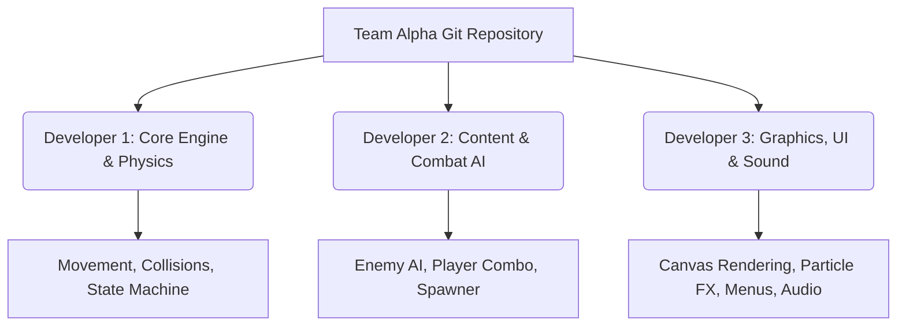

# Implementation Plan: Meeting Disorder (Office Hack-and-Slash)

Welcome, **Team Alpha**! Let's build an incredible, high-octane 2.5D office-themed hack-and-slash game inspired by the legendary *Golden Axe*. In **Meeting Disorder**, you will battle through the corporate ladder, turning tedious office interactions into action-packed brawls. 

This document outlines the architecture, features, and step-by-step plan to launch your project and deliver a stellar 5-minute playable demo.

---

## Technical Architecture & Tech Stack

For a 5-minute web-playable demo created rapidly with AI guidance, we recommend a modern web-based setup using **Vite + HTML5 Canvas + TypeScript**. 

### Why this stack?
1. **Zero Install for Players**: Your game runs instantly in any browser. No bulky executables or plugins are needed for judges/colleagues to play.
2. **AI-Friendly Development**: Modern AI can generate, refactor, and bug-fix pure TypeScript/canvas code extremely rapidly. There are no proprietary black boxes.
3. **High Performance**: HTML5 Canvas with custom rendering easily supports 60fps retro graphics, detailed particle systems, and multiple entities.
4. **Lightweight and Portable**: The bundle size is tiny (under 2MB), which can be deployed to **GitHub Pages** with a single click.

---

## User Review Required

Before starting code generation, please review and confirm:
1. **Game Dimension Strategy**: Do you prefer 2.5D retro pixel art (like *Golden Axe*, where players can move up/down/left/right and sort by depth) or a pure 2D side-scroller (like *Mario* or *Castlevania*)? (We recommend **2.5D isometric/depth-sorted side-scroller** for the authentic Golden Axe feel).
2. **Character Classes**: Are you happy with the three proposed classes (Developer, Product Manager, Designer), or do you want to modify them?
3. **Development Roles**: How would you like to divide responsibilities among the three of you? (We propose a division below).

---

## Open Questions

> [!IMPORTANT]
> **1. Controls & Input**: Do you want support for Gamepads/Controllers, or is standard Keyboard (WASD + J/K/L) sufficient?
> **2. Asset Production**: Should we use high-quality procedurally generated CSS/Canvas vector shapes, styled retro pixel art sprites, or preload static image files generated via AI image generation? (We recommend a combination of procedural animations and gorgeous static backdrop illustrations).

---

## Proposed Game Mechanics

### 1. Movement and Depth (2.5D isometric)
* **Depth Sorting**: Players and enemies move horizontally (`x`) and vertically (`y`) on the floor, but are sorted on the screen by their `y` coordinate so that characters closer to the screen render in front of characters further back.
* **Camera System**: Dynamic horizontal side-scrolling camera that locks when a wave of enemies spawns, unlocking only when all enemies are defeated.

### 2. Action and Combat
* **Basic Combo**: 3-stage light melee attacks with hit-stun.
* **Heavy Attack**: Slower but higher damage and knocks enemies back.
* **Jump Attack**: Airborne slash to evade ground hazards and intercept flying enemies.
* **Special Ability (The "Meeting Invite" or "Deadline")**: An area-of-effect (AoE) board-clear move consuming "Coffee/Energy" points.

### 3. Corporate Enemies
* **The Micro-Manager**: Moves fast, strikes with a clipboard, yells speech-bubble projectiles ("Is this done?").
* **The Zoom Zombie**: Slow moving, attacks in hordes, spits video-feed buffers.
* **The Coffee Machine Beast (Boss)**: Shoots burning espresso pools, charges with steam, drops coffee cups for HP recovery.

---

## Proposed Collaboration Workflow (Team of 3)

To ensure smooth progress, you can divide tasks based on three core areas:



* **Developer 1 (Core Engine & Mechanics)**: Setting up Vite, input handling, collision system, boundary restrictions, and the game state loop.
* **Developer 2 (AI, Combat & Content)**: Character classes, combo sequences, enemy movement patterns, wave spawning, and level progression.
* **Developer 3 (Aesthetics & Interface)**: Glassmorphic menus, player HUD (HP, Energy), juice (screen shake, damage numbers, sparks, paper particles), and synthesizer audio (Web Audio API).

---

## Proposed File Structure

We will initialize the repository with a highly structured template:

```
meeting-disorder/
├── index.html               # Main container
├── package.json             # Project metadata and run scripts
├── tsconfig.json            # TypeScript configuration
├── vite.config.ts           # Vite development server config
├── public/                  # Static assets (sounds, fonts)
└── src/
    ├── main.ts              # Entry point & central Game engine class
    ├── types.ts             # Global interfaces (Entity, Attack, Vector)
    ├── input.ts             # Input keyboard listeners
    ├── entities/
    │   ├── Entity.ts        # Base entity class
    │   ├── Player.ts        # Player logic & classes (Dev, PM, Designer)
    │   └── Enemy.ts         # Enemy AI & classes (Manager, Zoom Zombie)
    ├── system/
    │   ├── Collision.ts     # AABB collision detection & resolution
    │   ├── Particle.ts      # Visual FX (coffee spills, code blocks, sparks)
    │   └── Sound.ts         # Retro SFX generator using Web Audio API
    └── ui/
        ├── Menu.ts          # Start, Character Select, Game Over screens
        └── HUD.ts           # Health bars, coffee meter, boss health
```

---

## Implementation Stages

### Stage 1: Setup & Engine Foundation (Today)
- Initialize project with Vite, TypeScript, and a single-file development test environment.
- Implement the standard game loop, 2.5D depth sorting, and basic player movement.

### Stage 2: Combat & Physics
- Build collision boxes (hitboxes and hurtboxes).
- Implement attack combos, hit detection, hit-stun, and knockbacks.

### Stage 3: Enemies & Spawner AI
- Add simple state machines for enemies (Idle, Chase, Attack, Hit, Die).
- Create a Spawner that manages enemy waves and locks the camera.

### Stage 4: Polish, UI & SFX ("Juice" phase)
- Add floating damage text, screen shake, hit freeze, and particles.
- Add retro synthesized audio (swish, hit, power-up, explosion) using the Web Audio API (no external file dependencies).
- Build start menu, character selection screen, and game over overlay.

---

## Verification Plan

### Automated Tests
- Run `npm run lint` and `npm run build` to verify type safety and compilation.

### Manual Verification
- **WASD/Arrow Movement**: Confirm characters move smoothly in all 8 directions with sliding deceleration.
- **Combat Combos**: Verify pressing `J` performs a 3-part combo and triggers the attack visualizer.
- **Depth Rendering**: Verify that if a player stands behind an enemy, they render behind, and when they walk below, they render in front.
